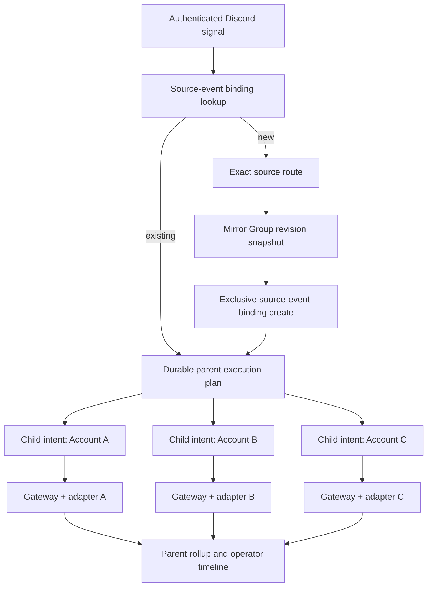
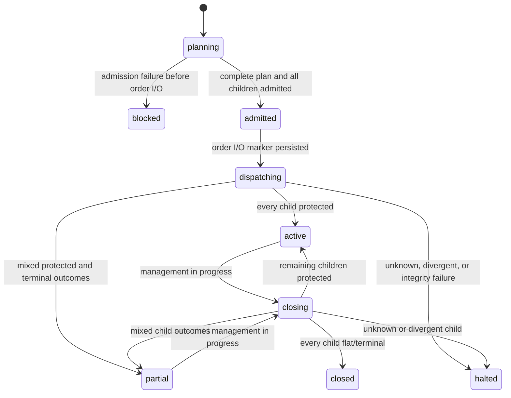

# Multi-Account Mirror Groups

## Decision Summary

Trade God will support one authenticated Discord entry across multiple exact
trading accounts through a versioned **Mirror Group**. The source message creates
one durable parent execution and one independent child `order-intent@1` per
member account. Every child retains its own risk decision, authorization,
provider command, fill, position, protection orders, receipts, and recovery
state.

This is coordinated fan-out, not a distributed transaction. Trade God can make
the plan deterministic, durable, idempotent, and observable, but it cannot make
separate broker accounts fill at the same price or commit atomically. Before
order/mutation I/O, admission is all-members-or-none. After order/mutation I/O
begins, each child is reconciled independently and partial outcomes are
surfaced rather than hidden or automatically reversed.

Discord follow-ups resolve to the parent trade lineage, then create exact
per-child management plans. `Move stops to BE` means each active child moves its
own verified stop to its own verified average fill. No agent, timestamp, display
name, or global “latest trade” heuristic selects an account or order.

## User Outcome

As the operator, I can route selected Discord traders to a named group of paper
accounts, see the exact quantity and readiness of every member before entry,
and manage the resulting positions as one visible trade family without losing
the independent provider truth of each account.

## Product Truth

- **Reliable** means durable planning, deterministic IDs, independent account
  reconciliation, exact follow-up lineage, bounded retries, visible partial
  outcomes, and restart recovery.
- **Reliable does not mean** simultaneous fills, equal slippage, or atomic
  cross-account execution.
- In this spec, **order/mutation I/O** means submit, modify, cancel, or flatten.
  Read-only provider connection, snapshot, and reconciliation calls are allowed
  during admission because current account truth is required to fail closed.
- A group is an execution target, not execution authority.
- An analytical agent never receives broker credentials or raw browser control.
- A group cannot weaken any member account's risk, approval, certification,
  kill-switch, or provider preflight.
- Per-account approval is necessary but not sufficient: the complete fan-out
  must also fit the operator's explicit group-level aggregate risk envelope.

## Scope

- Multiple Discord source routes may target one Mirror Group.
- One source identity resolves to exactly one target: a single account or one
  Mirror Group.
- One parent execution snapshots the active group revision and creates one
  child intent per admitted member.
- Member-level quantity rules: source quantity or fixed contracts.
- Group-level aggregate initial-risk and active-parent limits.
- All-member admission before the first provider mutation.
- Bounded-parallel child dispatch after durable admission.
- Parent/child state rollups, receipts, alerts, and restart recovery.
- Group-aware partial close, flatten, stop movement, and stopped-out
  reconciliation.
- Pausing new entries without abandoning active child trades.
- Global, source, group, and connection kill scopes.
- Paper-only rollout before any evaluation, performance, or live use.

## Non-Goals

- Atomic commit or rollback across accounts or providers.
- Guaranteed equal entry price, fill time, slippage, or exit price.
- Copying one provider order ID across accounts.
- Automatically flattening successful children because another child failed.
- Joining a newly added member to a trade already in progress.
- Detaching a removed member from an active trade lineage.
- Percentage, balance-proportional, volatility, or model-selected sizing in the
  first release.
- Automatic pyramiding or Discord `add` signals in the first release.
- Cross-environment groups such as paper plus evaluation or evaluation plus
  live.
- Implicit product conversion such as NQ to MNQ or ES to MES. V1 mirrors one
  exact canonical contract; provider symbol formatting may differ, economic
  exposure may not.
- Treating the DiscoTrader daemon as a second broker/execution authority.
- A generic trade copier outside the existing gateway.

## Current Reality

Verified in this checkout:

- `TradingSignalRouteStore` maps one immutable Discord
  server/channel/trader identity to one exact `connection_id`.
- Silent route reassignment is rejected without explicit prior-account proof.
- `FileDiscoTraderIntentSource` creates one deterministic
  `order-intent@1` from one ticket and one resolved connection.
- `ExecutionGateway` owns per-intent durable claims, adapter selection,
  idempotency, protection, reconciliation, management, recovery, and kill
  switches.
- `FileDiscordTradeManager` resolves one active Discord trade using exact reply,
  thread, channel, author, and symbol evidence. It never uses a global latest
  trade.
- Each protected execution receipt identifies the child's exact provider orders,
  open quantity, verified stop, and average fill.
- The Electron runtime deliberately attaches zero live execution adapters until
  an exact paper adapter is certified.

Not implemented:

- Mirror Group contracts, persistence, configuration UI, or group routing.
- Parent execution/fan-out coordination.
- Group-level management receipts and queues.
- Group kill state or parent/child dashboard rollups.
- Real-provider paper evidence for multi-account entry or management.

### Required changes to current contracts

- Signal routes currently contain only `connection_id`; they need the versioned
  account-or-group target union.
- DiscoTrader child intent identity currently derives from the ticket alone;
  mirrored children would collide unless group revision/member identity enters
  the hash.
- `order-intent@1` binds one connection but has no parent lineage fields; parent
  linkage must live in a verified source artifact/new contract without weakening
  the existing child intent.
- `risk-decision@1` binds an account snapshot but does not expose a normalized
  aggregate-risk upper bound. Mirroring needs a versioned companion projection
  or additive contract before group limits can be enforced.
- The current DiscoTrader source artifact requires child quantity and risk to
  equal the original ticket. Fixed member sizing therefore requires a new
  mirror-child source artifact; the original ticket must never be rewritten.
- `discord-management-receipt@1` resolves one intent and cannot represent an
  action-by-child matrix; it remains readable while the new parent receipt is
  added.
- Gateway locking is per intent. Netted futures safety also requires durable
  provider-account/instrument ownership and provider-account command
  serialization.
- Runtime recovery must recover gateway children, rebuild parents, recover
  management, and validate leases before accepting new webhooks.
- Durable claim markers need an orphan-repair audit because a marker can survive
  failure of the following record write.
- Runtime still attaches zero provider adapters, so this feature is not
  paper-executable today.

## Core Invariants

1. One Discord source identity has one active route target.
   Its first accepted immutable message is durably bound before later route or
   group edits can affect replay.
2. A route target is either one connection or one Mirror Group, never both.
3. A group revision contains each broker account at most once.
4. Every child intent references exactly one connection and one parent
   execution.
5. Group membership and quantity rules are frozen for the lifetime of a parent
   execution.
6. Editing a group affects new entries only.
7. Every child passes its own connection, certification, risk, authorization,
   capability, and provider preflight.
8. No order/mutation I/O occurs until the complete parent plan and every child
   intent are durably persisted and admitted.
9. A mirror child cannot cross the gateway's order/mutation boundary without a
   checksum-bound parent dispatch grant naming that exact child and admitted
   parent plan.
10. After order/mutation I/O begins, missing child records are an integrity
    failure; they are never invented during recovery.
11. Provider IDs, fills, positions, stops, and targets never cross child
    boundaries.
12. A Discord follow-up resolves one parent lineage before it addresses child
    trades.
13. A management instruction may partially succeed across children, but every
    child result is explicit and reconciled.
14. Unknown submission, unknown protection, or divergence never triggers blind
    retry or transport fallback.
15. Group status is a rollup; broker truth remains in child execution records.
16. Pausing or editing a group cannot silently abandon active risk.
17. For netted futures accounts, at most one active parent trade may own a
    `provider_account_key + instrument` pair. A second trade blocks before
    order/mutation I/O unless an adapter explicitly proves segregated position
    ownership.
18. Manual/unowned broker exposure or working orders on the same account and
    instrument block mirrored entry; Trade God never assumes which trade owns
    a net position.
19. The sum of individually allowed child plans must also pass the frozen
    group-level aggregate risk envelope; missing or unbounded aggregate risk
    blocks the entire parent.
20. Position ownership is keyed by immutable underlying provider account
    identity plus instrument, not by `connection_id`; duplicate connection
    records cannot create duplicate ownership.
21. Every child uses the parent's frozen canonical contract/expiry. Instrument
    family resemblance never authorizes mini/micro or expiry substitution.

## Experience / Runtime Flow

### Configure a group

1. The operator opens **Futures -> DiscoTrader -> Mirror Groups**.
2. The operator creates a group, selects one environment, and chooses exact
   trading connections.
3. For every member, the operator chooses `source quantity` or an exact fixed
   contract quantity and sets a member maximum.
4. Trade God validates unique underlying accounts, matching environment,
   connection readiness, adapter certification, authorization mode/basis
   readiness, and supported instruments/operations. The actual bounded
   authorization is validated again for every child at signal time.
5. The operator saves a new immutable group revision.
6. The operator assigns one or more observed Discord source identities to the
   group through the existing source-route surface.
7. The group may be activated only when all current members are paper-ready.

### Execute a mirrored entry

1. DiscoTrader sends one authenticated entry ticket.
2. Trade God checks the immutable source-event binding before current routing.
   An existing binding resumes its recorded single-account or group execution.
3. For a new event, one serialized transaction resolves the route, snapshots
   the current group revision, and exclusively persists that target binding.
4. It derives deterministic member quantities and child intent IDs.
5. It persists one parent plan, the complete ordered child list, every
   mirror-child source artifact, and every `order-intent@1` idempotently.
6. It performs read-only account/capability preflight, evaluates risk and
   authorization for every child, then
   evaluates the full plan against the group's aggregate risk limits.
7. If any child fails, the parent becomes `blocked`; no order/mutation I/O
   occurs and any already-approved child is canceled.
8. Under the group admission queue, Trade God reserves aggregate risk, then
   acquires all provider-account/instrument ownership leases in one atomic,
   globally sorted set operation. Lease failure releases the unused risk
   reservation.
9. It freshly revalidates broker-flat/no-working-order truth, risk freshness,
   authorization, and kills while those ownership claims are held.
10. Any revalidation failure blocks the parent, cancels approved children, and
    releases leases only after fresh broker-flat/no-orders confirmation.
11. If all children pass, Trade God persists one child-specific dispatch grant
    per intent and marks the parent `admitted` before dispatch.
12. The gateway verifies the grant before each child may cross its existing
    provider command boundary.
13. Child submissions begin with bounded parallelism and provider-account
    queues.
14. Each child independently reaches protected, rejected, unknown, halted, or
    another existing gateway state.
15. The parent rollup and UI show every child result. `Active` is claimed only
    when all intended children are protected.

### Execute a mirrored follow-up

1. A signed Discord management message is parsed conservatively.
2. Exact reply/thread/channel/author/symbol evidence resolves one parent trade
   lineage.
3. The current group's membership is ignored; the entry-time child snapshot is
   authoritative.
4. Trade God reconciles every child before planning mutations.
5. It validates that every active child can express the full instruction. Any
   preflight failure blocks the whole follow-up before provider mutation.
6. It persists one parent management receipt plus exact per-child action plans.
7. Each child's actions execute in order; children may execute in bounded
   parallel.
8. Within a child, `half then BE` cannot move the stop unless its partial close
   reconciles and the remaining position has one verified stop.
9. Across children after order/mutation I/O starts, one failure does not cause
   another child to guess, retry, or roll back.
10. The parent receipt becomes `completed`, `partial`, `blocked`, or `halted`
   with exact evidence for each child.

## Architecture



The parent coordinator never submits provider commands itself. It materializes
and coordinates child intents through the existing gateway.

## System Boundaries

| Component | Owns | Must not own |
|---|---|---|
| DiscoTrader | Authenticated source observation, parsing, ticket delivery | Account selection, group membership, broker mutation |
| Signal route store | Exact source identity to one target reference | Child sizing, provider mutations |
| Mirror Group store | Versioned membership and allocation configuration | Active provider truth |
| Mirror coordinator | Parent plan, deterministic fan-out, aggregate state, recovery | Provider-specific execution |
| Risk/authorization | Per-child admission using exact account truth | Group configuration or broker credentials |
| Execution gateway | Existing child lifecycle, idempotency, reconciliation | Cross-child guessing or compensation |
| Mirror management manager | Parent-lineage resolution and per-child plans | Global latest-trade inference |
| Provider adapter | One exact account's commands and truth | Group rollup or other accounts |
| Renderer | Setup, readiness, receipts, controls | Execution truth or secrets |

## Contracts

### Source-event binding `source-execution-binding@2`

One binding protects both existing single-account execution and Mirror Groups
from route/revision drift on retries.

```ts
interface SourceExecutionBindingV2 {
  source_execution_binding_schema_version: 'source-execution-binding@2'
  binding_id: string
  source_type: 'discord'
  server_id: string
  channel_id: string
  author_id: string
  message_id: string
  ticket_id: string
  ticket_checksum: string
  route_id: string
  instrument: {
    canonical_id: string
    symbol: string
    exchange: string
    expiry?: string
    tick_size: string
    point_value_usd: string
  }
  received_at: string
  target:
    | { type: 'connection'; connection_id: string; intent_id: string }
    | {
        type: 'mirror-group'
        mirror_group_id: string
        mirror_group_revision: number
        group_snapshot_checksum: string
        mirror_execution_id: string
      }
  state: 'bound' | 'materialized' | 'halted'
  created_at: string
  updated_at: string
  content_checksum: string
}
```

The binding ID derives from immutable Discord server/channel/message identity,
not from the current route. The first accepted checksum wins. A replay with a
different ticket/checksum is tampering and halts; a valid replay returns or
recovers the recorded target before reading current routes. Route resolution,
group revision capture, and exclusive binding creation occur under one
serialized operation shared with route/group target mutation. A crash after
binding but before materialization resumes from the binding and cannot select a
different account.

Lookup indexes both immutable message ID and ticket ID. The ticket index stores
the complete checksum-valid binding, including frozen instrument economics and
trusted receipt time, so a crash before the source index write is recoverable.
Either identity may find the binding, but both must agree when present;
disagreement halts.

Before accepting webhooks after the contract ships, Trade God performs a
one-time legacy backfill:

1. Read only checksum-valid legacy DiscoTrader source artifacts and gateway
   records.
2. Derive a single-account binding from their recorded source identity,
   `connection_id`, and `intent_id`; never consult the current route.
3. If a legacy record lacks identity needed for eager binding, index its ticket
   and intent as `legacy-unbound`. A matching authenticated replay may complete
   the binding only when its checksum and recorded connection agree.
4. Two legacy records claiming one source identity, checksum disagreement, or
   target disagreement halts webhook intake until explicit recovery; it never
   picks the newest record.
5. Persist a migration receipt and complete this audit before normal source
   binding recovery or new routing.

### Route target `trading-signal-route@2`

```ts
type TradingSignalTarget =
  | { type: 'connection'; connection_id: string }
  | { type: 'mirror-group'; mirror_group_id: string }

interface TradingSignalRouteV2 {
  route_schema_version: 'trading-signal-route@2'
  route_id: string
  display_name: string
  source_type: 'discord'
  server_id: string
  channel_id: string
  trader_author_id: string
  target: TradingSignalTarget
  enabled: boolean
  created_at: string
  updated_at: string
}
```

Existing routes migrate losslessly to `target.type = connection`. Migration
never infers a group.

### Mirror Group `mirror-group@1`

```ts
interface MirrorGroupV1 {
  mirror_group_schema_version: 'mirror-group@1'
  mirror_group_id: string
  revision: number
  display_name: string
  environment: 'paper' | 'evaluation' | 'performance' | 'live'
  state: 'draft' | 'active' | 'paused' | 'archived'
  admission_policy: 'all-members-before-order-mutation-io'
  dispatch_policy: {
    mode: 'bounded-parallel'
    max_concurrency: number // 1..4 in first release
  }
  portfolio_limits: {
    currency: 'USD'
    max_aggregate_initial_risk: string
    max_active_parent_trades: number
  }
  members: MirrorGroupMemberV1[] // 2..20 schema; paper rollout cap 5
  created_at: string
  updated_at: string
  content_checksum: string
}

interface MirrorGroupMemberV1 {
  member_id: string
  connection_id: string
  enabled: boolean
  quantity_rule:
    | { mode: 'source-quantity'; max_contracts: number }
    | { mode: 'fixed-contracts'; contracts: number; max_contracts: number }
}
```

Rules:

- `fixed-contracts.contracts <= max_contracts`.
- `source-quantity` copies the ticket's exact contract count for that account;
  it is not divided across members.
- The risk engine may reduce nothing. It allows or denies the exact child plan.
- V1 has no fractional multiplier or dynamic balance-based sizing.
- A group revision cannot repeat the same underlying
  firm/platform/environment/account identity under multiple connections.
- Active groups require at least two enabled members.
- V1 aggregate risk is USD-only. Every child must have a fresh
  `mirror-child-risk-projection@1`; a missing/unbounded value blocks admission
  instead of being treated as zero.

### Parent execution `mirror-execution@1`

```ts
interface MirrorExecutionV1 {
  mirror_execution_schema_version: 'mirror-execution@1'
  mirror_execution_id: string
  trace_id: string
  route_id: string
  mirror_group_id: string
  mirror_group_revision: number
  group_snapshot_checksum: string
  source: {
    ticket_id: string
    message_id: string
    author_id: string
    server_id: string
    channel_id: string
    ticket_checksum: string
    instrument_canonical_id: string
  }
  state:
    | 'planning'
    | 'blocked'
    | 'admitted'
    | 'dispatching'
    | 'active'
    | 'partial'
    | 'closing'
    | 'closed'
    | 'halted'
  children: MirrorExecutionChildV1[]
  order_mutation_io_started_at?: string
  transitions: MirrorExecutionTransitionV1[]
  created_at: string
  updated_at: string
  content_checksum: string
}

interface MirrorExecutionChildV1 {
  member_id: string
  connection_id: string
  intent_id: string
  planned_quantity: number
  quantity_rule_snapshot: MirrorGroupMemberV1['quantity_rule']
  state: 'planned' | 'admitted' | 'blocked' | 'dispatching' | 'protected'
       | 'terminal' | 'unknown' | 'divergent'
  execution_record_checksum?: string
  error_code?: string
}
```

The parent state is derived from children but persisted as an auditable
transition. It never replaces child execution records.

### Child lineage

Each child remains a valid `order-intent@1`. Its deterministic ID is derived
from:

```text
SHA-256(ticket id + source message id + group id + group revision + member id + connection id)
```

The child source artifact adds:

- `mirror_execution_id`;
- `mirror_group_id` and revision;
- `member_id`;
- parent ticket checksum;
- frozen quantity-rule evidence.

The same signal replay therefore finds the same parent and children. A later
group revision cannot change those IDs.

### Mirror child source `mirror-child-source@1`

The immutable Discord ticket remains source evidence; it is never changed to
pretend the trader requested a different quantity. Each child intent instead
references a derived, checksum-bound source artifact containing:

- source binding, parent execution, route, group, revision, member, connection,
  and ticket IDs/checksums;
- original ticket instrument, side, entry, stop, targets, and source quantity;
- frozen canonical contract/expiry and any certified provider symbol mapping;
- exact planned child quantity;
- frozen `source-quantity` or `fixed-contracts` rule;
- independently computed child risk and aggregate-risk upper-bound evidence;
- derivation version, timestamps, and content checksum.

The child `order-intent@1` quantity must equal the derived planned quantity, not
the original ticket quantity. Its separate risk decision and risk projection
must reference the same intent, account snapshot, planned quantity, and source
artifact. For `source-quantity`, source and planned quantities are equal. For
`fixed-contracts`, the difference is explicit and auditable.

### Child risk projection `mirror-child-risk-projection@1`

`risk-decision@1` still owns account-policy allow/deny. This companion contract
provides the normalized, conservative value needed for group aggregation:

```ts
interface MirrorChildRiskProjectionV1 {
  mirror_child_risk_projection_schema_version:
    'mirror-child-risk-projection@1'
  projection_id: string
  mirror_execution_id: string
  intent_id: string
  connection_id: string
  provider_account_key: string
  account_snapshot_id: string
  risk_decision_id: string
  mirror_child_source_checksum: string
  instrument_canonical_id: string
  planned_quantity: number
  valuation: {
    currency: 'USD'
    side: 'buy' | 'sell'
    entry_order_type: 'market' | 'limit' | 'stop' | 'stop-limit'
    adverse_entry_bound:
      | { kind: 'maximum-price'; price: string } // buy
      | { kind: 'minimum-price'; price: string } // sell
    protection:
      | { kind: 'absolute-price'; stop_price: string }
      | { kind: 'tick-distance'; ticks: number; tick_size: string }
    tick_value_usd: string
    instrument_value_version: string
    slippage_policy_version: string
    fees_policy_version: string
    fx_evidence_ref?: string
  }
  initial_risk_upper_bound_usd: string
  evaluated_at: string
  valid_until: string
  content_checksum: string
}
```

The calculation uses fixed-point decimal arithmetic and rounds risk upward. A
buy requires a maximum adverse entry price; a sell requires a minimum adverse
entry price. Protection is either an exact absolute stop or a positive integer
tick distance for fill-relative brackets. The calculation includes quantity,
tick value, adverse entry/slippage policy, stop distance, and configured fees.
Each order type needs a certified side-aware bound rule. Non-USD valuation needs
fresh checksum-bound FX evidence. Missing evidence, stale validity, a mismatched
side/bound kind, or a negative/non-finite result blocks admission. Revalidation
occurs before grants.

### Parent dispatch grant `mirror-dispatch-grant@1`

The coordinator issues one child-specific grant only after every planned child
passes admission. The gateway—not only the coordinator—must verify this grant
before a mirror child can submit an order.

```ts
interface MirrorDispatchGrantV1 {
  mirror_dispatch_grant_schema_version: 'mirror-dispatch-grant@1'
  grant_id: string
  mirror_execution_id: string
  intent_id: string
  connection_id: string
  admitted_parent_checksum: string
  complete_child_set_checksum: string
  issued_at: string
  expires_at: string
  content_checksum: string
}
```

The grant binds the exact parent snapshot, full admitted child set, child
intent, and connection. It has a short expiry, must still be valid when
submission begins, is single-purpose, and cannot authorize management or a
recalculated quantity. A missing, expired, mismatched, or tampered grant blocks
before the gateway persists its `submitting` transition or calls the adapter.

### Group risk reservation `mirror-risk-reservation@1`

Concurrent signals cannot each read the same apparent remaining group capacity
and both proceed. Admission therefore acquires one durable reservation under an
exclusive group queue before dispatch grants are issued.

Required fields:

- mirror execution, group, and frozen revision IDs;
- exact child risk projection IDs, USD upper bounds, and checksums;
- aggregate USD initial-risk upper bound;
- active-parent slot consumed;
- state: `reserved | releasing | released | halted`;
- timestamps and content checksum.

The reservation is released only after every child is broker-confirmed flat
with no working orders. Recovery rebuilds and validates reservations before new
admission. Unknown exposure keeps the reservation and halts rather than freeing
capacity optimistically.

### Position ownership `position-ownership-lease@1`

Futures positions are commonly netted at the account/instrument level. A
durable lease prevents two Trade God lineages from both claiming the same net
position and later moving or resizing the wrong protection order.

```ts
interface PositionOwnershipLeaseV1 {
  position_ownership_schema_version: 'position-ownership-lease@1'
  lease_id: string
  provider_account_key: string
  provider_account_identity_checksum: string
  connection_id: string
  instrument_canonical_id: string
  owner_type: 'single-intent' | 'mirror-child'
  owner_intent_id: string
  mirror_execution_id?: string
  state: 'acquired' | 'releasing' | 'released' | 'halted'
  acquired_at: string
  released_at?: string
  content_checksum: string
}
```

Rules:

- trusted main derives `provider_account_key` from normalized firm, platform,
  environment, and provider-confirmed immutable `account_ref`; unverified user
  input and renderer labels never participate;
- acquisition is exclusive for `provider_account_key +
  instrument_canonical_id` across both single-account and mirrored execution;
- multiple connection IDs for the same provider account share one ownership
  key and cannot bypass the lease;
- multi-account acquisition uses one durable registry transaction over globally
  sorted lease keys; it acquires every lease or none, preventing inverse-order
  deadlock and partial lease leakage;
- a lease is not released by time alone while provider exposure may exist;
- release requires broker-confirmed flat state and no working child orders;
- a blocked plan unwinds all newly acquired leases only after that same
  flat/no-orders proof; uncertain truth retains the leases and halts;
- an unowned provider position/order on the pair blocks acquisition;
- recovery validates leases before accepting new Discord deliveries;
- all entry and management calls for one provider account pass through an
  exclusive provider-account command queue in addition to existing per-intent
  locks.

### Parent management `mirror-management-receipt@1`

Required fields:

- source management message and checksum;
- resolved `mirror_execution_id`;
- resolution strategy and candidate parent IDs;
- ordered logical actions;
- frozen child target list;
- per-child concrete payload, request ID, gateway command ID, receipt ID,
  evidence, status, and error;
- aggregate status: `blocked | prepared | executing | completed | partial |
  halted`;
- timestamps and content checksum.

Child management request IDs derive from:

```text
management message checksum + logical action index + child intent id
```

This makes one message retry idempotent per child while allowing a later,
distinct Discord message to request the same logical action again.

## Routing and Resolution Rules

### Entry routing

1. Derive the immutable source binding ID and check it before current routes.
2. If found, validate the ticket checksum and resume only its frozen target.
3. If new, match immutable server, channel, and trader IDs.
4. Require exactly one enabled route and resolve its target.
5. For a group, require one active revision and no group kill.
6. Atomically persist the route/target/revision binding before materialization.
7. Snapshot enabled members.
8. Re-evaluate every member connection at signal time.
9. Block on missing, disabled, unready, uncertified, duplicated, or
   environment-mismatched members.

Fallback to a globally configured connection or “the only ready account” is
not allowed for a Mirror Group route.

### Follow-up resolution

Parent evidence strength remains:

1. reply to the original entry message;
2. reply to a prior accepted follow-up;
3. same thread plus explicit symbol;
4. same channel plus explicit symbol;
5. same author and channel/thread with exactly one active parent trade.

Child intents from one parent count as one candidate trade family. If more than
one parent still matches, the instruction is ambiguous and does nothing.

### Membership changes during a trade

- Add member: new entries only.
- Disable member: new entries only; active child remains managed.
- Remove member: allowed only by creating a new revision; active lineage stays.
- Delete connection: blocked while any non-terminal child references it.
- Pause group: stops new entry fan-out; active follow-ups remain available.
- Archive group: blocked until all child trades are terminal.

## Quantity and Risk Semantics

- Quantity is an integer per child, never a shared group total.
- `source-quantity` mirrors the source ticket count into every member.
- `fixed-contracts` uses the configured exact member count.
- Planned quantities are frozen before admission.
- Every child obtains its own account snapshot and risk decision.
- Each child produces a conservative initial-risk upper bound from its frozen
  entry/protection plan, instrument value, fees/slippage policy, and account
  currency conversion. V1 requires a fresh USD value; inability to bound it
  blocks the parent.
- The coordinator sums conservative child initial-risk upper bounds and checks
  `max_aggregate_initial_risk` plus `max_active_parent_trades` before issuing
  dispatch grants.
- Group aggregate risk is an additional gate; it cannot replace or weaken
  per-account risk evaluation.
- A denied child blocks the entire entry before order/mutation I/O.
- The first release rejects Discord `add`/pyramid signals for group targets.
- All children use the same canonical contract and expiry. A provider adapter
  may translate only to that provider's identifier for the same contract; it
  may not substitute another product or rollover month.

For `half` management:

- quantity is calculated independently from each child's reconciled open
  quantity;
- the exact integer is persisted before mutation;
- a one-contract or odd-quantity child that cannot express an exact configured
  half blocks the entire follow-up before order/mutation I/O;
- after all child payloads pass preflight and execution begins, a provider
  failure may still produce a visible partial result.

## State Model

### Parent entry state



`blocked` is terminal for that source signal. A new attempt requires a new
operator-approved source event, not mutation of the original parent.

### Aggregate state rules

- `active`: every planned child is protected.
- `partial`: at least one child has real provider exposure and at least one
  child did not reach the same safe state.
- `halted`: any child is submit-unknown, protection-unknown, divergent, or has
  an integrity failure requiring operator attention.
- `closed`: every child reconciles to no open position.
- The UI must never compress `partial` or `halted` into `active`.

## Concurrency and Ordering

- One exclusive parent claim per deterministic `mirror_execution_id`.
- One parent materialization queue prevents duplicate child creation.
- One durable group admission queue atomically checks capacity and acquires the
  aggregate risk reservation, preventing concurrent over-admission.
- Existing per-intent gateway locks remain authoritative for child operations.
- One durable queue per provider account serializes commands across different
  intents and connection records sharing the same broker account.
- A position-ownership lease serializes active lineage per
  provider-account/instrument for netted futures accounts.
- The parent transitions to `dispatching` before the first consequential
  provider call.
- Dispatch uses bounded parallelism, initially at most four children, further
  limited by adapter/provider rate policies.
- Follow-ups for one parent lineage use one durable queue.
- A second follow-up cannot overtake an executing earlier follow-up.
- Discord message identity and posted time are persisted. An older message
  arriving after a later mutation is complete becomes `late-after-mutation`
  and does nothing unless an exact reply contract defines a safe recovery path.
- Edited Discord messages remain evidence only and never mutate trades.

## Failure Semantics

| Failure | Required behavior |
|---|---|
| Missing/unready member during admission | Block parent; zero order/mutation I/O |
| Child risk denial | Block parent; cancel other approved children; zero order/mutation I/O |
| Provider account/instrument already owned or externally open | Block parent; zero order/mutation I/O |
| Missing/invalid child dispatch grant | Block child and parent before order I/O |
| Any child cannot express a management action | Block whole follow-up before mutation |
| Crash while materializing children | Idempotently finish materialization if parent never entered dispatching |
| Child rejection after dispatch | Preserve rejection; continue independent scheduled children; parent partial |
| Child submit unknown | No retry/fallback; connection kill; reconcile; parent halted |
| Child protection unknown | Existing emergency policy applies to that child; parent halted |
| Child divergence | Connection kill and operator alert; no guessed correction |
| One child management failure | Stop remaining actions for that child; other children continue; parent partial |
| Compound action failure | Never execute the next action for that child |
| Parent receipt corruption | Fail closed; global/group alert; no order/mutation I/O |
| Group edited mid-run | Active parent continues from frozen revision |
| Group paused mid-run | New entries stop; active management remains |

There is no automatic “rollback by flattening” after a partial entry. Flattening
is itself a consequential action with different fills and risks. The operator
may issue an explicit group flatten after reviewing the reconciled child states.

### Kill and exit policy

A kill switch means **do not create or increase exposure**. It must not trap the
operator in an already-open position. Global, source, group, and connection
kills use the same operation policy; the most restrictive active scope wins.

| Operation while killed | Policy |
|---|---|
| New entry, add, reverse, or size increase | Block |
| Read-only snapshot or reconcile | Allow |
| Cancel a still-unfilled entry order | Allow when exact provider identity is verified |
| Partial close or explicit flatten | Allow after fresh reconciliation and normal certification/authorization |
| Risk-reducing stop move | Allow only when deterministic policy proves it cannot increase worst-case risk |
| Resize/recreate protection after a reduction | Allow as the required certified compound close operation |
| Cancel protection without verified replacement or flatten | Block |
| Any mutation for submit-unknown/divergent ownership | Block until reconciliation resolves exact state |

An adapter/credential **quarantine** is stronger than a kill: it permits
read-only reconciliation only and blocks every mutation. The UI must distinguish
`Entries killed; exits available` from `Quarantined; reconcile only`. Emergency
exit commands remain explicit, durable, idempotent, independently reconciled,
and subject to the exact child account/order identity rules.

## Persistence and Recovery

Suggested layout under Trade God's execution directory:

```text
mirror-groups/
  source-bindings/<binding-id>.json
  source-bindings/legacy-unbound.json
  source-bindings/migration-receipt.json
  groups/<group-id>/revision-<n>.json
  groups/<group-id>/current.json
  executions/<mirror-execution-id>/parent.json
  executions/<mirror-execution-id>/children/<intent-id>/lineage.json
  executions/<mirror-execution-id>/children/<intent-id>/source.json
  executions/<mirror-execution-id>/children/<intent-id>/risk-projection.json
  management/<message-id>.json
  risk-reservations/<mirror-execution-id>.json
  ownership-leases.json
  claims/<mirror-execution-id>.claim.json
```

- Group revisions are append-only; `current.json` is an atomic pointer.
- Source bindings are exclusive-create records shared by single-account and
  group routing; recovery consults them before current routes.
- Ownership leases live in one atomically replaced registry so a sorted
  multi-key acquisition commits all keys or none.
- Parent execution is created with exclusive-create semantics.
- Parent and child artifacts are checksum-bound and path-safe.
- Materialization is idempotent while state is `planning`.
- `dispatching` is persisted before broker I/O.
- Restart in `planning` may complete missing deterministic child records.
- Restart in `dispatching` or later may only recover/reconcile existing child
  records; a missing child is an integrity failure.
- Parent rollup is rebuilt from verified child records and compared with the
  persisted parent checksum.
- Pending management resumes the same concrete child payloads and request IDs.
- Orphaned durable claim markers are repaired or halted before fan-out relies
  on them; a claim marker alone never proves a submitted command.

Startup recovery order is mandatory:

1. backfill/audit verified legacy Discord execution bindings and halt on
   conflicts;
2. recover exclusive source bindings and finish pre-dispatch materialization of
   their frozen targets;
3. recover/reconcile non-terminal gateway child records;
4. rebuild parent health from verified gateway truth;
5. recover pending parent management receipts;
6. validate group risk reservations and their child projections;
7. validate or release position-ownership leases;
8. accept new Discord entry and follow-up deliveries only after recovery
   completes or enters an explicit fail-closed halted state.

## Follow-Up Operation Semantics

### Move stop to breakeven

For each eligible child:

1. reconcile the child;
2. require protected state and one active stop sized to open quantity;
3. use that child's verified average fill, not the parent or first account fill;
4. persist the exact provider stop ID, quantity, order type, and target price;
5. issue one idempotent modify command;
6. reconcile and require verified remaining protection.

### Move stop to explicit price

The source price is shared evidence, but each child independently validates
instrument tick size, side, provider capability, current stop identity, and
open quantity.

### Partial close

The exact close quantity is calculated per child. The whole family preflight
must prove every active child has a safe integer reduction before any payload is
issued. All exact payloads are then persisted. After order/mutation I/O begins,
successful children resize/recreate protection according to their certified
adapter; failed children retain their prior reconciled position and protection
state, and the parent becomes partial or halted.

### Flatten

Attempt every known non-flat child independently, including children already
marked partial. A child with uncertain state must be reconciled first; it is
never assumed flat. Final success requires every child reconciled flat.

### Stopped out

No mutation. Reconcile every child and record which accounts are flat, still
open, or divergent.

## Agent Behavior

The agent may:

- explain the parent and child states;
- ask for approval using the exact frozen member/quantity plan;
- surface ambiguity, partial execution, or divergence;
- propose an explicit reconcile or flatten action.

The agent may not:

- select accounts from conversational memory;
- alter group membership or quantities during a signal;
- choose a “closest” child when lineage is ambiguous;
- invent provider IDs, fills, or stop prices;
- retry an unknown submit;
- hide a failed child because most accounts succeeded;
- claim the group is synchronized unless every child proves the same safe
  lifecycle state.

Durable stores, not chat history, are the source of truth.

## UI States

### Mirror Groups list

Each card shows:

- name and immutable group ID;
- current revision;
- environment;
- member count;
- ready/blocked member count;
- Discord source count;
- state: Draft, Ready, Degraded, Paused, or Archived;
- last paper certification/run evidence.

### Group editor

- Select exact accounts with firm, platform, environment, and account label.
- Set each member's quantity rule and maximum.
- Show certification, enabled state, authorization, and transport.
- Show per-child risk and the complete plan's aggregate initial-risk limit.
- Prevent duplicate underlying accounts and mixed environments inline.
- Preview a sample source quantity as exact child quantities and aggregate risk.
- Saving creates a new revision with a clear “active trades keep the old
  revision” notice.

### Route editor

The existing source target control becomes:

- **Single account**, or
- **Mirror Group**.

Changing either target requires explicit reassignment confirmation. The same
Discord identity cannot target both.

### Parent trade card

The group row shows source trader/message, symbol/side, aggregate state, and one
child row per account:

- planned/open quantity;
- fill and slippage;
- stop and targets;
- provider state;
- last reconciliation;
- warning/error;
- exact management result.

Partial and halted states remain expanded and visually prominent.

### Operator controls

- Pause new entries.
- Resume after readiness check.
- Reconcile group now.
- Kill group entries.
- Show whether risk-reducing management remains available or the account is
  fully quarantined.
- Explicitly flatten group with per-account confirmation summary.
- Open exact child account/session.

There is no one-click “mark synchronized” control.

## Security and Safety

- Configuration and mutation APIs live in Electron main/trusted packages.
- Renderer inputs are schema-validated and cannot supply certification,
  capabilities, provider IDs, or execution state.
- Credentials and browser sessions remain per connection in the trusted vault.
- Group configuration contains opaque connection IDs only.
- Every child needs its own current authorization/standing mandate.
- Per-order approval displays all exact child accounts, quantities, aggregate
  planned risk, and any unavailable member.
- Group kills are additive to global, source, and connection kills.
- Kill evaluation uses the operation matrix above; a generic kill cannot block
  safe reconciliation or conceal whether risk-reducing exits remain available.
- Group execution launches paper-only behind a feature flag.
- Consequential activation requires a separate approval/evidence gate and does
  not inherit paper certification.
- Schema supports at most 20 members; the first paper certification is capped
  at five.
- The group cannot mix paper, evaluation, performance, or live environments.

## Typed Errors

| Code | Retryable | Meaning / safe response |
|---|---:|---|
| `SOURCE_EXECUTION_BINDING_CONFLICT` | No | Immutable source was already bound or checksum changed |
| `MIRROR_GROUP_NOT_FOUND` | No | Route target is missing; block |
| `MIRROR_GROUP_NOT_ACTIVE` | No | Draft/paused/archived group; block |
| `MIRROR_GROUP_REVISION_CONFLICT` | No | Snapshot changed during planning; restart before I/O |
| `MIRROR_DUPLICATE_ACCOUNT` | No | Same underlying account appears twice |
| `MIRROR_ENVIRONMENT_MISMATCH` | No | Members do not share one environment |
| `MIRROR_POSITION_OWNERSHIP_CONFLICT` | After flat/reconcile | Provider account/instrument is owned or externally exposed |
| `MIRROR_LEASE_SET_CONFLICT` | After reconcile | Atomic multi-account lease set could not be acquired |
| `MIRROR_MEMBER_UNREADY` | After setup | Member lacks current readiness/certification |
| `MIRROR_ADMISSION_DENIED` | New signal only | One or more child risk/authorization checks failed |
| `MIRROR_AGGREGATE_RISK_DENIED` | New signal only | Complete fan-out exceeds or cannot prove the group envelope |
| `MIRROR_DISPATCH_GRANT_INVALID` | No | Child cannot cross the gateway order boundary |
| `MIRROR_PARENT_EXISTS` | Read existing | Duplicate source replay found durable parent |
| `MIRROR_CHILD_MISSING` | No after dispatch | Parent/child integrity failure |
| `MIRROR_PARTIAL_EXECUTION` | Reconcile only | Mixed child outcomes after order/mutation I/O |
| `MIRROR_CHILD_SUBMIT_UNKNOWN` | Reconcile only | Never retry or change transport |
| `MIRROR_CHILD_DIVERGENT` | Reconcile/manual | Provider and local truth disagree |
| `MIRROR_MANAGEMENT_AMBIGUOUS` | No | More than one parent lineage matches |
| `MIRROR_MANAGEMENT_PARTIAL` | Reconcile/manual | Not every child completed the follow-up |
| `MIRROR_LATE_FOLLOWUP` | No | Older instruction arrived after later mutation |
| `MIRROR_GROUP_KILLED` | After operator action | Group execution is halted |
| `MIRROR_CONNECTION_QUARANTINED` | After operator/recovery | Reconcile only; all mutations blocked |

## Observability and Receipts

Required correlation:

```text
Discord message ID
  -> mirror execution ID
    -> child intent ID
      -> connection ID
        -> gateway command ID
          -> provider order/position IDs
```

Structured events:

- `mirror_plan_created`;
- `mirror_admission_blocked`;
- `mirror_dispatch_started`;
- `mirror_child_state_changed`;
- `mirror_parent_state_changed`;
- `mirror_management_prepared`;
- `mirror_management_child_completed`;
- `mirror_partial_execution`;
- `mirror_recovery_started/completed/failed`.

Metrics:

- all-members-admitted rate;
- all-children-protected rate;
- partial/unknown/divergent rate;
- child dispatch skew and time-to-protected;
- per-provider rejection/slippage;
- follow-up completion rate by operation;
- recovery count and unresolved age;
- number of groups/members by environment.

## Concrete Examples

### Valid group entry

Source: `LONG MNQ`, source quantity `2`.

| Child | Rule | Planned | Result |
|---|---|---:|---|
| Apex Paper A | source quantity, max 4 | 2 MNQ | protected |
| Apex Paper B | fixed 1, max 2 | 1 MNQ | protected |
| Tradovate Demo | source quantity, max 2 | 2 MNQ | protected |

Parent state: `active`. Each row has its own fill and stop ID.

### Partial entry

- Account A reaches protected.
- Account B rejects before acknowledgment.
- Account C becomes submit-unknown.

Parent state: `halted`, not active. Account C is connection-killed and
reconciled. Account A is not automatically flattened. The UI requires operator
attention and offers explicit reconcile/flatten controls.

### Breakeven follow-up

- Child A average fill: `21450.25`; its stop moves to `21450.25`.
- Child B average fill: `21450.50`; its stop moves to `21450.50`.
- Child C is already flat; it records a reconciled no-op.

No group-average price is invented.

### Ambiguous follow-up

The trader has two active NQ parent trades in the same channel and sends
`move stop to BE` without replying. Resolution returns two parent candidates,
persists a blocked receipt, and sends no provider mutation.

## Test Matrix

### Contracts and persistence

- source-event binding is exclusive across single-account and group routes;
- legacy single-account source artifacts backfill bindings without consulting
  current routes;
- legacy binding identity/target conflicts halt webhook intake;
- valid replay after route reassignment/group edit returns the original target;
- same immutable source identity with a changed checksum halts as tampering;
- route v1 to v2 migration preserves exact single-account target;
- group checksum/revision validation;
- duplicate underlying account rejection;
- mixed-environment rejection;
- deterministic parent/child IDs;
- same source replay returns same complete plan;
- parent/child corruption and missing files fail closed;
- group edits do not change active snapshots.

### Admission and entry

- two to five ready paper members;
- one disabled/unready/uncertified member causes zero order/mutation I/O;
- per-child risk denial cancels approved siblings and causes zero
  order/mutation I/O;
- group aggregate risk above limit, missing, stale, or unbounded causes zero
  order/mutation I/O;
- child risk projections prove fixed-point upward rounding, validity windows,
  fees/slippage, and FX evidence behavior;
- risk projection matrix covers long/short by market/limit entry and
  absolute-price/tick-distance protection; unsupported stop-entry bounds block;
- concurrent parent admissions cannot overbook one group's risk or active-trade
  capacity;
- lease-set failure releases its unused group risk reservation;
- broker exposure appearing between initial preflight and held-lease
  revalidation blocks before order/mutation I/O;
- direct gateway execution of a mirror child without its valid parent dispatch
  grant is refused;
- source and fixed quantities;
- exact contract/expiry parity across children; NQ-to-MNQ and rollover
  substitution block;
- fixed quantity preserves original ticket quantity and binds the independently
  derived child quantity/risk in `mirror-child-source@1`;
- source quantity above a member max blocks admission;
- duplicate signal concurrency creates one parent and one child per member;
- one reject, one protected, one submit-unknown;
- adapter rate limiting and bounded parallelism;
- dispatch skew measurement;
- global/source/group/connection kill behavior;
- kill operation matrix at every scope: entry blocked, reconcile allowed,
  certified risk reduction allowed, exposure increase blocked;
- quarantine permits reconcile only.

### Follow-ups

- reply to entry resolves parent family;
- reply to prior follow-up resolves same parent;
- same channel/symbol resolves exactly one parent;
- multiple parent trades remain ambiguous;
- each child BE uses its own fill;
- explicit stop uses each child's exact stop ID;
- half on children with different open quantities;
- one-contract/odd quantity child blocks the whole follow-up before I/O;
- `half then BE` ordering per child;
- one child failure stops only that child's remaining compound actions;
- group flatten requires every child reconciled flat;
- stopped-out performs reconciliation only;
- duplicate and out-of-order management messages;
- ownership conflict with another Trade God lineage;
- unowned manual/provider position on the same account/instrument;
- provider-account ordering across two different connection IDs/source signals;
- inverse-order overlapping-group lease contention acquires all or none without
  deadlock or leakage.

### Crash and recovery

- crash before parent plan write;
- crash after source binding but before parent materialization resumes the
  frozen target;
- restart during legacy backfill resumes idempotently before webhook intake;
- crash after parent plan but before child materialization;
- crash after all child records but before dispatch marker;
- crash after dispatch marker before first order call;
- crash with one submitting, one protected, and one rejected child;
- crash between partial close and stop resize on one child;
- replay recovers exact child payloads and never recalculates quantity;
- no missing child is created after order/mutation I/O starts.

### UI and operator safety

- readiness labels distinguish configured, admitted, active, partial, halted;
- route target reassignment requires confirmation;
- active revision warning when group is edited;
- connection deletion blocked by active child lineage;
- parent summary refreshes after child changes;
- keyboard/screen-reader access for group editor and error details;
- no credentials/provider secrets in renderer payloads or logs.

## Evaluation Plan

Minimum paper evidence before enabling provider-backed Mirror Groups:

1. Deterministic fixture suite with two, three, and five fake accounts.
2. Forced reject, timeout, submit-unknown, protection failure, divergence, and
   restart at every durable boundary.
3. At least 100 complete fake-provider group lifecycles with zero duplicate
   child submissions and zero orphaned protection.
4. At least 50 real Tradovate paper group lifecycles at the certified member
   cap, including entry, partial close, stop move, flatten, and restart.
5. Zero unresolved submit-unknown, unprotected position, duplicate order,
   wrong-account mutation, wrong-stop mutation, or silent partial result.
6. Recorded dispatch skew, fill variance, reconciliation latency, and provider
   rate-limit behavior.

Mixed-provider groups require a separate certification matrix after homogeneous
Tradovate paper groups pass.

## Acceptance Criteria

- [ ] A Discord source can target one Mirror Group without also targeting a
  single connection.
- [ ] Existing single-account routes migrate without behavior change.
- [ ] Verified legacy single-account executions receive source bindings before
  webhook intake; conflicts halt rather than following the current route.
- [ ] One source replay creates exactly one parent and one deterministic child
  per snapshotted member.
- [ ] Route reassignment or group edits after first acceptance cannot retarget a
  replay; a checksum mismatch halts.
- [ ] A failed admission produces zero order/mutation provider calls across the
  group.
- [ ] Individually allowed child plans still block when their total exceeds the
  frozen group risk envelope.
- [ ] Every aggregate risk reservation references fresh checksum-valid child
  risk projections whose exact USD sum matches the reserved amount.
- [ ] Concurrent signals cannot overbook the same group's aggregate risk or
  active-parent limit.
- [ ] A mirror child cannot submit without a valid checksum-bound dispatch
  grant from its fully admitted parent.
- [ ] Every submitted child has an independent gateway record and provider
  evidence.
- [ ] Fixed sizing is represented by a derived mirror-child source artifact;
  the immutable Discord ticket is never rewritten.
- [ ] A second lineage or unowned provider position on the same netted
  account/instrument blocks before order/mutation I/O.
- [ ] No parent is labeled active unless every planned child is protected.
- [ ] Mixed post-dispatch outcomes are visible as partial/halted.
- [ ] A follow-up resolves the parent lineage before child actions.
- [ ] Every BE stop uses that child's own verified average fill and stop ID.
- [ ] Ambiguous follow-ups produce zero mutations.
- [ ] Duplicate/restarted entry and management work never duplicates provider
  commands.
- [ ] Group edits affect new entries only.
- [ ] Pausing a group blocks new entries while preserving active management.
- [ ] Group, source, connection, and global kills block new risk while retaining
  explicitly defined reconcile/exit behavior; quarantine permits reconcile
  only.
- [ ] Paper rollout evidence meets the evaluation gate.
- [ ] No renderer/agent surface gains credentials or unrestricted broker/browser
  authority.

## Verification Commands

| Command/action | Proves | Expected result |
|---|---|---|
| `bun test packages/trading-contracts` | Contracts and migrations | Pass |
| `bun test packages/trading-execution` | Fan-out, gateway, management, recovery | Pass |
| Focused Electron main/IPC/preload/renderer tests | Trusted runtime and UI boundaries | Pass |
| `bun run typecheck:all` | Cross-package contract compatibility | Pass |
| Electron main/preload/renderer builds | Production bundling | Pass |
| Fake-provider forced-failure matrix | Idempotency and partial-state truth | Zero unsafe defects |
| Real Tradovate paper lifecycle run | Provider-backed group behavior | Evidence retained; all gates pass |
| Manual crash/restart smoke | Real persisted recovery path | No duplicate or orphaned order |

## Rollout and Reversal

### Stage 0 — Contracts only

- Add contracts, group store, migration, and fixtures.
- No UI execution and no provider adapter attachment.

### Stage 1 — Configuration and dry-run preview

- Create groups and assign routes.
- Render exact child plans and readiness.
- Persist simulated parents; send zero provider commands.

### Stage 2 — Fake-provider paper orchestration

- Enable parent/child coordinator behind
  `TRADE_GOD_MIRROR_GROUPS=paper-preview`.
- Prove failure injection and restart boundaries.

### Stage 3 — Tradovate paper entry

- Maximum five accounts.
- Homogeneous provider/transport only.
- Entry and protection before follow-up automation.

### Stage 4 — Tradovate paper management

- Partial close, stop move, stopped-out reconcile, and flatten.
- Complete the real paper evidence matrix.

### Stage 5 — Mixed-provider paper

- Only after each adapter is independently certified for every required
  operation.

### Consequential environments

Out of scope until separately approved. They require new expiring enablement,
authorization evidence, limits, canary rules, and rollback planning.

Reversal:

- Pause all groups and keep single-account route support.
- Existing parent/child records remain readable and manageable.
- Never migrate an active group trade back into one synthetic single-account
  record.
- Route v2 can continue targeting connections if group execution is disabled.

## Risks and Edge Cases

1. **Partial cross-account execution:** unavoidable after order/mutation I/O;
   make it explicit, reconciled, alerted, and operator-actionable.
2. **Wrong-account/wrong-stop mutation:** prevented by frozen lineage and exact
   child provider IDs plus provider-account/instrument ownership leases; any
   ambiguity blocks.
3. **Unknown submit:** never retry; kill/reconcile the exact child connection.
4. **Provider rate limits or session expiry:** bounded dispatch plus per-child
   failure evidence; admission must not overclaim runtime session health.
5. **Group edits during active trades:** immutable revisions and parent
   snapshots prevent drift.
6. **Different fills and quantities:** every child computes BE and partial-close
   payloads from its own reconciled truth.
7. **Fast/out-of-order follow-ups:** durable per-parent queue; late mutations
   block instead of overtaking.
8. **Overlapping groups/accounts:** allowed across different source signals, but
   per-account risk/open-exposure gates remain authoritative.
9. **One-contract “half” instructions:** cannot be represented; the complete
   follow-up blocks before mutating any account.
10. **Connection removal:** blocked while referenced by active group revisions
    or non-terminal child executions.
11. **Contract rollover/product aliasing:** exact frozen contract identity wins;
    an expired, unavailable, or economically different contract blocks instead
    of being substituted.

## Open Questions

These defaults are recommended for the first paper release and need operator
acceptance before implementation leaves Stage 1:

1. **Initial member cap:** recommend five accounts despite a schema maximum of
   twenty.
2. **Default quantity rule:** recommend source quantity with a mandatory
   per-member maximum; fixed contracts remain available.
3. **Partial-entry compensation:** recommend no automatic flatten. Alert and
   require explicit operator action.
4. **Mixed providers:** recommend homogeneous Tradovate paper groups first.
5. **Group envelope:** recommend one active parent for the initial paper stage;
   the USD aggregate-risk limit has no guessed product default and must be set
   explicitly by the operator per group.

## Implementation Plan

1. Add source binding, mirror-child source, child risk projection, Mirror Group,
   parent execution/dispatch/risk, parent management, and typed error contracts
   in `packages/trading-contracts`.
2. Add lossless route v2 migration and target-union validation in the Electron
   route store.
3. Add legacy single-account source-binding backfill and pre-webhook conflict
   audit.
4. Add gateway-enforced, child-specific parent dispatch grants.
5. Add append-only group revision storage and active-reference deletion guards.
6. Add durable provider-account/instrument ownership leases,
   provider-account queues, and recovery before webhook acceptance.
7. Extend the DiscoTrader intent source to derive deterministic parent/child
   lineage without changing donor broker authority.
8. Implement parent admission/materialization coordinator over the existing
   gateway.
9. Implement aggregate rollup, the explicit kill/exit/quarantine matrix,
   recovery, and observability.
10. Add group-aware Discord management resolution and parent/child receipts.
11. Add IPC/preload APIs and Mirror Groups UI with dry-run preview first.
12. Run the complete fake-provider and forced-failure matrix.
13. Wire one certified Tradovate paper adapter and run the retained paper gate.

## External References

- [Tradovate API](https://api.tradovate.com/) — official REST/OpenAPI reference
  consulted 2026-08-03. It exposes account/contract `Position` records with
  `netPos`, separates read/query operations from submit/modify operations, and
  states that modify/liquidate requests are requests rather than guaranteed
  outcomes. This supports account-level ownership and mandatory reconciliation;
  it does not prove this app's access or certification.
- [Tradovate Partner API rate limits](https://partner.tradovate.com/overview/core-concepts/rate-limits)
  — official rate-limit behavior consulted 2026-08-03. Adapter/provider queues
  must honor returned backoff rather than retrying fan-out blindly.

## Evidence Log

- 2026-08-03: specification created from the live route store, DiscoTrader
  intent source, execution gateway/store, Discord management manager, current
  account UI, and trading documentation. No Mirror Group implementation or
  runtime claim is made.
