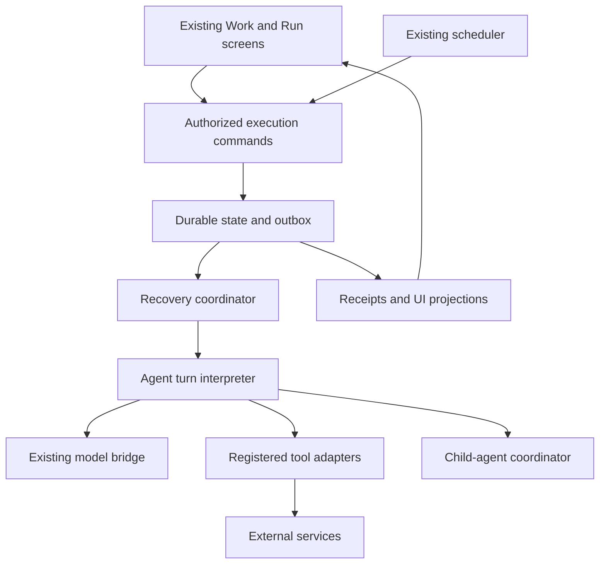

# Workflow durable-execution upgrade

Revision: r2 · Authorized Phase P-01 implementation contract · 2026-09-09

## 1. Purpose and authority

Make Artist OS long-running workflows recover predictably across app crashes, restarts, sleep, provider outages, and interrupted approvals. Preserve existing workflow authoring, agents, tools, receipts, outputs, permission controls, and Work screens. Upgrade the execution underneath them.

The user authorized amendment and implementation of the first related task group, followed by rival review and fixes, on 2026-09-09. Execute P-01 as an isolated architecture proof; production admission remains disabled. Later phases retain their entry/exit engineering gates. This contract is not evidence that the upgrade has shipped; do not manufacture repeated user approval gates for already-authorized local engineering.

**Product promise:** for a supported workflow, committed work survives restart; already recorded operations are reused; unfinished operations follow an explicit recovery policy; ambiguous external outcomes are surfaced instead of silently repeated. Users can tell what completed, what is waiting, and what needs their decision.

“Exactly once” is restricted to a defined transactional boundary or a verified provider contract. A local journal cannot guarantee that an arbitrary external API executes exactly once. No promise of progress while the Mac is powered off, a required account is disconnected, or the disk is unavailable.

### Source register

Repository baseline: `/Users/michaelb.williams/RunnerOS/.worktrees/main/artist-os`, branch `main`, commit `8ce9f5c11782caa3c46713df8a9b7150513c95eb`. Source-file versions below are pinned to that commit. Revalidate before implementation.

| ID | Source | Authority and inspected scope |
| --- | --- | --- |
| S-USER | Current user request and preceding architecture discussion | Binding intent: thorough upgrade spec; reliability of multijob/multiagent workflows; retain useful engineering; no unjustified rewrite. |
| S-RUN | `packages/server-core/src/workflows/runner.ts`; `packages/shared/src/workflows/run-storage.ts`; `run-types.ts` | Current implementation: frozen inputs, transitions, rerun-from-step, receipts, JSON snapshots. |
| S-SESSION | `packages/server-core/src/sessions/SessionManager.ts` | Main runner construction and recovery; hidden sessions; agent delegation and message flow. |
| S-APPROVAL | `packages/shared/src/agent/escalation-store.ts`; `subconscious-mode.ts` | SQLite escalation storage versus in-memory execution waits. |
| S-CHILD | `packages/shared/src/agent-messaging/{types,storage,validation}.ts` | Parent/child receipts, permissions, depth and task limits; file persistence. |
| S-SCHEDULE | `packages/server-core/src/scheduled-work/{ScheduledWorkRunner,AutomationWorkQueue}.ts`; `packages/shared/src/automations/{automation-system,scheduler-state}.ts`; `handlers/queue-work-handler.ts` | Durable scheduler checkpoint, catch-up, queue deduplication, uncertainty handling, continuation fences. |
| S-OLD | `docs/workflows/01-spec.md`, `02-runtime.md`, `06-recovery-plan.md`, `07-active-work-dashboard-and-launcher-spec.md` | Existing format and UX; conservative explicit recovery. Old framework arguments are historical, not a binding ban on databases. |
| S-PYTHON | `tools/squad/vendor/squad/scripts/run_creative_production_durable.py`; `creative/production/durable_runner.py` under the same vendor root | Optional DBOS production runner. No assumption that main workflow execution uses this path. |
| S-DBOS | [DBOS architecture](https://docs.dbos.dev/architecture), [TypeScript workflow guarantees](https://docs.dbos.dev/typescript/tutorials/workflow-tutorial), consulted 2026-09-09 | Reference: recorded-step recovery, deterministic orchestration, retry-safe steps, version compatibility. Not an Artist OS integration claim. |
| S-SQLITE | [SQLite WAL](https://www.sqlite.org/wal.html), [synchronous settings](https://www.sqlite.org/pragma.html#pragma_synchronous), consulted 2026-09-09 | Reference: local WAL constraints and durability settings. |
| S-EXCERPT | User-pasted Rome/DeepSeek description | Motivation only. Their repositories were not inspected; table count, code size and alleged guarantees are not independently certified. |

Precedence: user intent → this contract when authorized for implementation → current code as evidence of current behavior → older plans and external examples. New contracts here are explicitly proposed. This packet owns the upgrade plan; `plan.json` owns task dependencies/status. Existing project handoffs remain the project-wide status authority.

## 2. Current foundation and actual gaps

| Area | Verified foundation | Upgrade needed |
| --- | --- | --- |
| Main runtime | Custom TypeScript runner; DBOS is optional in a separate Python lane | One explicit durability contract for participating execution paths |
| Workflow recovery | Saves transitions; freezes definition/inputs; preserves earlier successful outputs; identifies interruption | Resume below whole-agent-step granularity |
| Operation evidence | Step execution and child-agent receipts | Enforced operation identity, stored results, durable continuation and safe retries |
| Approvals | SQLite WAL store; restrictive database file permissions | Reconstruct the waiting operation after process death; atomically consume a decision |
| Scheduling | Persisted ticks; missed-schedule catch-up; queue keys; stale work becomes visible attention | Atomic occurrence admission and recovery across scheduler/queue boundaries |
| External publishing | Stops on uncertain post-restart outcomes instead of automatically posting again | Provider-specific reconciliation, linked operation identity and conserved budgets |
| Persistence | Atomic temporary-file replacement | Transactional journal with defined disk-failure, migration and backup behavior |

The prior audit ran 248 focused tests successfully. These support the existing behavior, not this proposed upgrade. They were not real process-kill, power-loss or live-provider certifications. See `evidence/baseline.md`.

## 3. Scope and success criteria

### In scope

- Main TypeScript workflow execution, its agent turns and participating tool calls.
- Parent/child delegation within those workflows, including required joins and detached children explicitly tracked as separate jobs.
- Approval waits, timers, queue admission, scheduling catch-up, cancellation and explicit user steering.
- Local transactional execution state; compatibility projections into existing receipts, Run and Active views.
- Capability classification for every reachable tool. Unsupported adapters remain visible and conservatively recoverable; they never acquire a false auto-resume guarantee.
- Migration, backup/restore, upgrade compatibility, operational evidence and rollout controls.

### Deferred or excluded

- Replacing agents, model SDKs, WORKFLOW.md, existing output stores, or Keychain.
- A visual DAG editor, arbitrary workflow language, general JavaScript stack serialization, or introducing parallel-group/conditional syntax currently rejected by the parser.
- Cross-machine automatic failover, shared SQLite over a network/sync folder, a mandatory cloud account, or unattended progress when no runtime is online.
- Rewriting the optional Python DBOS implementation. It may later join through the same adapter contracts; until certified it retains its current guarantees.
- Automatic retries of opaque shell/browser actions whose external effects cannot be determined.

### Required acceptance targets

These are proposed release targets, not measurements of the existing app:

1. Zero duplicate committed local mutations or required child dispatches in the fault matrix. Zero automatic resend of an unresolved non-idempotent external action.
2. All supported nonterminal runs are classified after restart: runnable, waiting on a known dependency, paused, or needs attention. None remain indefinitely “running” on the basis of a dead process.
3. Completed recorded LLM turns/tool results are reused without a new model/provider call during recovery.
4. Each approved operation produces at most one local dispatch claim; crash recovery honors its provider-specific effect policy.
5. Each schedule occurrence has one admission identity; repeated wakes and restarts produce no extra job for that identity.
6. Proposed reference load: 10,000 retained runs, 1,000 nonterminal runs, 100,000 operation rows and four active child agents. Recovery classification p95 ≤10 seconds after journal readiness; local control commands p95 ≤250 ms; journal-only operation overhead p95 ≤25 ms on a recorded reference Mac. Exclude provider latency; measure actual packaged runtime. If targets fail, report the measured bottleneck before proposing revised targets.
7. Fault tests exercise real separate processes and persistent provider simulators. The default rollout remains off until gates pass.

## 4. Requirement register

All P0/P1 rows are in scope. Acceptance IDs refer to section 15. All derive from S-USER plus the evidence named here; proposed numerical defaults remain technical decisions subject to measured review.

| ID | Priority | Obligation | Source | Acceptance |
| --- | --- | --- | --- | --- |
| R-01 | P0 | Preserve workflow format, output lineage, permissions and existing run visibility | S-RUN, S-OLD | A-01, A-18 |
| R-02 | P0 | Commit durable state before acknowledging or dispatching dependent work; reject unsafe storage modes | S-RUN, S-SQLITE | A-02, A-14 |
| R-03 | P0 | Stable operation identity, canonical inputs, strict divergence detection and reusable completed results | S-RUN, S-DBOS | A-03, A-04 |
| R-04 | P0 | Persist model turns/tool batches and resume from a recorded continuation | S-SESSION | A-05 |
| R-05 | P0 | Classify and reconcile external effects; bound retry amplification and cost | S-SCHEDULE, S-DBOS | A-06, A-07 |
| R-06 | P0 | Persist approval waits and consume exact authorized decisions once across restart | S-APPROVAL | A-08 |
| R-07 | P0 | Persist child creation, results, joins and inherited constraints | S-CHILD | A-09 |
| R-08 | P0 | Enforce ownership epochs and terminal/cancellation fences | S-SCHEDULE | A-10, A-11 |
| R-09 | P0 | Atomically admit schedule occurrences and apply explicit overdue policy | S-SCHEDULE | A-12 |
| R-10 | P0 | Pin compatibility and support reversible, nonduplicating migration | S-RUN, S-OLD | A-13, A-18 |
| R-11 | P0 | Keep credentials out of the journal and scope every command to the workspace/principal | S-APPROVAL, S-CHILD | A-15 |
| R-12 | P1 | Show clear recovery states and safe actions in existing Work/Run views | S-OLD | A-16 |
| R-13 | P0 | Conserve budgets, attempts and deadlines across retry, delegation, sleep and restart | S-CHILD, S-SCHEDULE | A-07, A-17 |
| R-14 | P1 | Provide reconciliation telemetry, backup, retention and a recovery runbook | S-RUN, S-SQLITE | A-14, A-19 |
| R-15 | P0 | Release only after independent fault testing and staged compatibility verification | All current-code sources | A-01–A-20 |
| R-16 | Deferred | Cross-machine automatic recovery and distributed leases | S-USER local reliability goal | Separate design required; no network-share SQLite |
| R-17 | Excluded | Broad product rewrite or new workflow editor | S-USER | Preserve existing authoring and surfaces |

## 5. Architecture decision and bounded proof

**Primary path to prove: an embedded SQLite execution journal behind a small TypeScript interface.** SQLite matches the current desktop deployment and existing database experience. Retain the runner as the product orchestrator; add a durable state-machine interpreter at recorded agent-turn/tool boundaries. Do not try to replay arbitrary application JavaScript or use ambient AsyncLocalStorage as durable state.

This is a candidate to prove in Phase P-01, not permission to invent a new general-purpose workflow framework. Keep the DBOS comparison bounded: check documented TypeScript storage/runtime prerequisites first. Reject a main-engine integration that requires Postgres, another service, or a broad rewrite; in that case record a documentation-only constraints rejection, not failed runtime correctness. Only if those constraints pass, compare a thin adapter against the same interrupted-approval + child + external-effect scenario. Check actual supported SDK/runtime/storage versions, packaging, offline startup, operational dependencies and maintained recovery features. DBOS's documented model is checkpointed steps with deterministic orchestration and retry-safe effects; using it does not remove adapter-level responsibilities. [Reference](https://docs.dbos.dev/architecture)

Select DBOS only if it meets the embedded desktop constraints and materially reduces correctness work without replacing agents or requiring unapproved infrastructure. Select the local journal if that remains the smallest supportable implementation and it passes the proof. Do not ship two active engines for the same run. Record the decision, tradeoffs and rejected assumptions in an ADR before P-02. Replan the persistence implementation if the choice changes; the product and safety contracts remain.



### Ownership boundaries

- Journal owns admitted runs, operations, wait conditions, exact approval consumption, child edges, occurrence identity, budgets and event/outbox sequence for v2 runs.
- Coordinator owns admission, leases, recovery classification, cancellation and runnable selection.
- Agent-turn interpreter owns recording model responses, stable call positions and the next continuation. It calls the existing model bridge.
- Adapter registry owns tool normalization, authorization check, effect class, idempotency/reconciliation contract and result schema.
- Existing output/session stores retain content ownership. Journal references verified persisted artifacts; reconciliation closes cross-store gaps.
- Existing JSON receipts/run snapshots become versioned projections for v2, not a competing writable authority. Legacy runs keep their current authority.
- Rendering never starts execution merely because a component mounts or reconnects.

## 6. State and identity contracts

### Run and operation states

Run state (proposed internal v2): `queued`, `running`, `waiting-approval`, `waiting-child`, `waiting-time`, `waiting-provider`, `paused`, `cancel-requested`, `succeeded`, `failed`, `cancelled`, `needs-attention`. Preserve existing public types through an explicit mapping until consumers migrate. `recoveryReason` explains why a nonterminal run was reclassified; process death does not itself mean business failure.

Operation state: `prepared` → `dispatched` → `succeeded` or `failed`; it may wait for approval before dispatch, wait for retry at a stored time after a known retryable failure, or become `unknown` after ambiguous dispatch. `unknown` permits reconciliation only. Reconciliation resolves to recorded success, definite non-execution eligible for policy-approved retry, or needs attention. Cancellation records intent independently; it cannot erase a real external success.

Terminal run outcome cannot be overwritten by a late worker. A late authenticated provider result may append an outcome observation after cancellation, with visible explanation, but cannot start successors or turn a cancelled run into succeeded. Only the authorized state machine may transition records; ad-hoc SQL updates are not operational recovery.

### IDs and canonicalization

- `runId`: stable for automatic recovery. Explicit rerun creates a new run with lineage and a documented side-effect policy.
- `stepInstanceId`: stable declared step plus recorded iteration/branch instance. Never derive from completion order.
- `turnId`: persisted agent-turn ordinal under a step/child; model/provider routing decision is pinned per attempt.
- `operationId`: allocated before execution from parent scope + recorded call slot + operation version, or a durable generated ID bound to that unique tuple. Different identical calls receive different IDs. Retries retain the same logical ID and separate `attemptId`s.
- `childRunId`: allocated transactionally with the parent dispatch operation. A unique constraint prevents two children for that operation.
- `occurrenceId`: workspace + schedule ID + schedule revision + intended UTC occurrence. Catch-up uses that occurrence identity, not wake time.
- `commandId`: caller-supplied UUID for repeat-safe control commands; unique with workspace/principal scope and a request digest.

Canonicalize validated JSON inputs with a versioned scheme: sort object keys recursively, preserve array order and meaningful string bytes, reject nonfinite numbers/unsupported values, represent binary/artifacts by verified content digest and immutable reference. Preserve omitted versus null where schema distinguishes them. Bind resolved defaults, tool version, target account identity, permission/action scope and referenced content digests. Do not hash ephemeral access tokens or re-resolve defaults on replay. Normalization occurs once through the adapter before hashing.

A replay identity match with different canonical input, tool version, target, output schema or continuation signature raises `execution-diverged` and stops before dispatch. There is no production “fallthrough” that executes changed work under an old identity. Source edits or user steering create a recorded new revision/boundary; they do not alter old recorded requests.

Explicit rerun is not an escape from effect uncertainty. Link the source operations and expose completed/unknown effects before authorizing repeats. Preserve copied earlier successful steps as immutable references with source lineage; do not issue new provider keys for an unknown action merely because it now has a new run ID. Repeating an effect intentionally is a separately identified, explicitly authorized operation. Read-only recomputation may follow the existing rerun permission policy.

### Agent nondeterminism

Record the complete usable model turn—including ordered tool requests and call IDs—before executing any requested tool. Persist the validated tool batch and continuation atomically. Reuse that turn on restart; do not ask the model to regenerate the same plan and hope hashes match.

Persist tool results before advancing to the next model turn. If a crash occurs during a model stream, partial text is presentation evidence only. No partially parsed tool call executes. A lost, uncommitted model response can require another model request, subject to the retry/cost policy; the old call may still have incurred cost. Mark that uncertainty. For providers offering resumable response/job IDs, record and reconcile them. Do not promise zero duplicate inference spend when the provider cannot identify the lost request.

Dynamic parallel calls reserve all child slots before dispatch and assemble results in their recorded logical order. Any opaque SDK/tool loop that cannot expose these boundaries must be marked unsupported for automatic inner-step recovery until an adapter exists.

## 7. Proposed persistence model

For the SQLite candidate, place the database under the private Artist OS configuration root, keyed by workspace identity; resolve the path through existing configuration helpers. Do not put a live WAL database in a shared/synchronized workspace. The exact basename is an ADR detail. A restored/copied workspace does not inherit automatic execution authority.

### Logical tables

These are logical contracts, not mandated table count or final SQL migrations. All foreign keys and unique constraints include workspace scope where applicable.

| Table | Required fields and constraints |
| --- | --- |
| `execution_runs` | run ID, workspace, engine version, definition/input digests and references, compatibility manifest, state/version, owner/epoch/lease, parent lineage, cancellation revision, created/updated timestamps |
| `execution_steps` | run+step instance unique, state, session/output references, validated completion contract, next turn/continuation |
| `execution_operations` | operation ID, parent scope/call slot unique, input digest/ref, adapter/effect/version, state/version, result ref/digest, approval ref, retry time, provider identity/idempotency ref |
| `execution_attempts` | operation+attempt unique, owner epoch, dispatch time, endpoint/account identity, outcome classification, provider request/job ID, error, usage observation |
| `execution_waits` | typed persisted continuation: approval, child, timer, provider; operation/run binding, deadline, resolution version |
| `execution_decisions` | decision ID, exact action digest, principal, target account, policy revision, expiry, consumed operation and timestamp |
| `execution_children` | parent operation unique, child run unique, required/detached mode, join policy, result reference and inheritance snapshot |
| `execution_occurrences` | schedule identity/revision/intended instant unique, eligibility/coalescing metadata, admitted run ID unique, status |
| `execution_events` | immutable per-run sequence, entity/version, event type, minimal redacted payload; unique sequence |
| `execution_outbox` | durable projection/dispatch/notification work, unique dedupe key, ack/version, attempts and next time |
| `execution_budgets` | budget owner and reservations keyed by operation; estimated, committed and unresolved usage; limits and revision |
| `execution_commands` | workspace/principal+command ID unique, request digest, result reference |

Start with the smallest schema that preserves these logical contracts. Dedicated child/schedule/budget tables may wait, but durable child identity and inherited limits must precede delegation; persisted cost reservations and attempt limits must precede any paid call (including model calls); occurrence deduplication must precede schedule admission. Fault tests verify these requirements rather than deciding whether they exist.

Use a normalized current-state row plus an immutable audit event in the same transaction. Full event-sourcing of the entire app is unnecessary. Large transcripts and generated media stay in existing content storage. If a payload is essential to replay, its immutable referenced bytes must survive at least as long as the run can resume.

### Transaction and disk requirements

- Verify `journal_mode=WAL`, `synchronous=FULL`, `foreign_keys=ON`, bounded busy timeout and supported `user_version` on each writer connection. Refuse `OFF`, `MEMORY`, in-memory production state and unknown newer schemas. In-memory unit fixtures are explicitly labeled nondurability tests. WAL still depends on reliable storage flush behavior; do not claim hardware-independent power-loss immunity. [SQLite settings](https://www.sqlite.org/pragma.html#pragma_synchronous)
- Private directory mode 0700 and database/WAL/SHM/backup files 0600, verified after creation/rotation. Enforce through the supported platform helper; failure blocks execution rather than silently widening access.
- Commit admission + occurrence identity + initial outbox item together. Commit local mutation + result + next continuation together when they share the journal database.
- Where data lives in another store, use an idempotent outbox command and a durable completion observation. Do not call two independent writes “atomic.”
- Do not hold a transaction across an LLM/network call, approval wait or long filesystem operation.
- Publish filesystem artifacts as immutable, flushed temp files followed by atomic rename before committing their references. A crash before the reference commit leaves an orphan eligible for cleanup; a missing referenced artifact blocks dependent work. Never run a successor against an uncommitted output.
- On disk-full, I/O error, corruption or persistent lock failure, stop new external dispatch. An already dispatched operation whose result cannot be saved becomes a recovery/reconciliation problem. Do not report it safely completed or blindly retry it.
- No silent reset to an empty database after corruption. Expose diagnostic state and restore options.

## 8. Execution and external-effect protocol

A machine-enforced, versioned adapter certification manifest is required for v2 admission and immediately before every dispatch. Bind the available toolset, effect class, canonicalization version, result schema and recovery policy. Recheck child, dynamically loaded, shell/browser and SDK-managed paths; admission-only inspection is insufficient. Unknown or bypassing calls stop before dispatch. Legacy selection is allowed only before admission: never downgrade an active v2 run into legacy execution. A conservative nonreplayable adapter is supported only when explicitly declared and tested.

Every supported tool registers an effect policy before it can execute in v2:

| Class | Examples | Recovery policy |
| --- | --- | --- |
| `pure` | Deterministic local transformation | Recompute if no result; otherwise reuse |
| `read` | Search/read endpoint | Bounded retry; reuse recorded result so later replay does not observe changed data |
| `transactional-local` | Mutation in the same journal DB | Mutation and completion commit together |
| `idempotent-external` | Provider supports a documented request key | Retry identical operation/key only within verified provider retention and scope |
| `reconcilable-external` | Job API with durable job ID/status lookup | Look up completion first; retry only after authoritative non-execution |
| `nonreplayable-external` | Opaque browser submit, email send without dedupe, arbitrary shell action | After possible dispatch, mark unknown; require reconciliation or explicit new action |

Paid read/generation calls also require budget accounting. Tool labels are not inferred from names. Undeclared adapters are rejected before v2 dispatch; they cannot acquire certification by defaulting an effect label. A read-only wrapper around a write-capable tool is not proof of read-only behavior.

### Required sequence

1. Validate workspace, actor, permissions, account target, payload, schema and inherited limits.
2. In a transaction, allocate operation, bind request digest, reserve budget and store required wait/approval state. On replay, reuse its result or follow its existing state.
3. If authorization is needed, persist the exact proposed action and continuation. No external dispatch occurs yet.
4. Immediately before every dispatch attempt, including after an approval, timer or queue wait, revalidate current pause/cancellation, permissions/policy revision, target account, approval validity, budget and deadline. Bind their relevant revisions to the compare-and-set state/version/owner-epoch claim; record attempt and dispatch intent before crossing the external boundary. A stale preparation decision cannot authorize dispatch. A revocation racing an already issued external request cannot undo it; retain that outcome for reconciliation.
5. Make the request using the stable provider idempotency key when available. Secrets are fetched from current secure storage, not the journal.
6. Commit outcome/result, cost observation, audit event and next continuation together. Emit UI/projection updates through the outbox after commit.
7. If transport or process failure prevents determining the outcome, reconcile under the adapter's contract. Absence from a eventually consistent listing alone does not prove non-execution.

Provider capability records must specify endpoint/account scope, idempotency TTL, status-query consistency, retryable errors and reconciliation deadline. Past a dedupe TTL, the old key is not assumed safe. No provider-certified capability is claimed until the actual API/SDK version and target are verified.

### Failure and retry policy

- One coordinator owns the logical retry budget. Account for any SDK retries; disable overlapping retries where possible. Otherwise expose/charge them and record the limitation.
- Persist attempts, backoff, jitter outcome, next attempt instant and last classification. Honor provider Retry-After within a bounded deadline. Restart does not reset attempts.
- Authentication refresh may retry a provably rejected request within the same logical operation. Revocation or changed target account pauses for reconnection/revalidation. It does not silently switch the action to another account.
- A model fallback is permitted only by the existing authorized routing policy and before committing a usable response for that turn. Record each route attempt. An external write never falls back to another service merely because the first result is uncertain.
- A timeout is not evidence that a provider did nothing. Handle timeout-after-dispatch as unknown unless the adapter proves otherwise.
- For automatic paid dispatch under a hard spending limit, reserve an enforceable maximum cost across the whole run/child tree: for example a provider-enforced spend cap or verified pricing plus enforced token/work limits. Estimates alone are insufficient. If no enforceable bound exists, classify the cost as unbounded/estimated, retain existing explicit spending authorization requirements, and do not claim hard-limit protection for that adapter. On known completion reconcile actual usage; on uncertain paid outcome retain the upper-bound reservation. Do not release it just because the process died. User-authorized limit increases are versioned; no retry resets the budget.

## 9. Durable approvals, steering and cancellation

An approval binds operation ID, canonical action digest, target account, workspace, approving principal, relevant policy revision and expiry. It never authorizes “whatever the model decides next.” Existing session-level permissions remain applicable; this upgrade does not introduce approval prompts for previously authorized actions.

Decision intake uses `commandId` plus expected entity version. Repeated identical approval returns its recorded result. A conflicting decision returns a conflict. Persist approval consumption and runnable dispatch claim in one journal transaction. The existing escalation database/UI is an imported input/projection for v2, with stable IDs and an inbox/outbox bridge if retained separately. Never treat writes to the escalation DB and journal as a single transaction.

After restart, load the recorded wait and exact operation, then reevaluate expiry, cancellation, target account and current access. An unchanged, still-valid approval can proceed without asking again. Changed actions or materially revoked scope need a new decision. Denial/expiry becomes a durable outcome; it does not reconstruct a dead Promise.

User steering is persisted as an ordered command at a safe turn boundary. Completed results remain immutable; changed future work gets a new continuation revision. If steering changes an approved payload, invalidate that unused approval. Do not replay old effects to make a new narrative consistent.

Internal read-runner implementation contract (r6): command receipt acknowledges a saved update; boundary assignment records its ordered delivery. Select updates before the initial model turn or after a completed tool batch. A successor model reservation freezes that boundary's selection. An update arriving after selection but before a new reservation requires replay/reselection; an update arriving after reservation takes effect at the next boundary. Completion cannot discard an already queued update. Never-dispatched replaced calls receive an explicit skipped disposition and lose unused approvals; already-dispatched reads retain their identity and recovery path. Paused runs keep updates queued without resuming. This internal contract does not enable public escalation routing or writable effects.

Cancel first records cancellation intent and fences new work, then signals active sessions/tools/children. Late results are retained as observations. If an external action might still complete, show “Stopped; checking an in-flight action” or an equivalent precise state. Do not equate aborting a local request with undoing the remote action. Rollbacks/compensating actions are new, separately authorized operations.

Pause blocks new dispatch while allowing outstanding observations to settle; resume reevaluates eligibility. Existing approved permissions persist unless expired/revoked. Run deadlines and wait expiries have explicit semantics: absolute user deadlines include sleep; active-compute limits exclude suspended/wait time; attempt limits and budget totals always persist.

## 10. Child agents and multijob chains

Create the child identity, parent edge, dispatch operation and inherited constraints in one transaction before launching the child session. Crash before launch leaves a recoverable admission; crash after launch attaches to the same child identity. A fresh child is never created just because a parent callback was lost.

Persist depth, maximum turns, allowed sources/skills, permission ceiling, budget owner and output schema. Children cannot widen the parent's permission ceiling or obtain fresh per-child budgets that evade the root limit. Preserve existing tighter per-agent constraints.

Required child completion must reference a committed, validated result. The parent resumes its join exactly once through a unique completion event. Lost/duplicated callbacks or UI events are harmless. Child success text without the required output is not parent success. Timeouts and failures follow a persisted join policy; no silent conversion to empty success.

Parallel children get stable slots at admission. Completion order never determines identity or output order. A parent awaiting required children cannot report completed. Detached children have explicit independent lifecycle/visibility; detachment is not an accidental consequence of parent cancellation. By default cancellation propagates to owned children; explicit detached work follows its recorded policy and remains visible.

The same contracts cover ScheduledWorkRunner continuation rounds: persist the next round admission and consumed predecessor completion once, preserve goal revision/ownership fences, and retain bounded depth/round count. No second coordinator should independently advance the same chain.

## 11. Ownership, startup, sleep and scheduling

### Ownership

Use a local execution owner with a per-process boot ID, a persisted monotonic epoch and bounded leases. A transaction claims ownership only when eligibility and prior ownership rules permit. Every subsequent write/dispatch claim includes the epoch and record version. Stale workers cannot complete current state or enqueue successors.

Proposed defaults: heartbeat every 5 seconds; suspect owner after 30 seconds; startup recovery verifies prior process identity/liveness before reclaim. Sleep/clock jumps do not by themselves prove a second worker may issue an external write. On wake, pause dispatch until ownership is revalidated. Cross-machine lease takeover is excluded.

Fencing protects local commits; it cannot withdraw a request already sent to a provider. For a dispatched operation, lease expiry never authorizes a resend by itself. Apply idempotency/reconciliation policy first. Test an old worker returning after a new owner is active.

### Startup sequence

1. Verify storage path, schema, integrity/migration status and execution ownership.
2. Perform bounded local classification of nonterminal operations and pending outbox records before admitting catch-up work. Schedule external reconciliation in the background with per-provider timeouts and bounded concurrency; an offline provider blocks only dependent/conflicting work, not unrelated eligible workflows.
3. Restore approvals, child joins and timers; classify incompatible/ambiguous runs into visible attention.
4. Resume only supported eligible operations whose existing user authorization permits continuation. Preserve explicit pause/cancel/deadline decisions.
5. Admit due schedule occurrences with the queue capacity and existing top-level execution-lane rules.
6. Rebuild projections and subscribe the renderer by event cursor. A disconnected renderer does not own runtime progress.

### Schedule policy

Preserve the current missed-work capability and the existing 24-hour start grace as the migration default for scheduled work. Do not silently turn it into either replay-all or skip-all.

For a recurring daily pass, default catch-up policy is `coalesce-latest`: after downtime admit the latest eligible missed occurrence once, record the skipped/coalesced range, then schedule the next future occurrence. Repeated wakes use the same occurrence ID. A one-time reminder keeps its own intended occurrence and becomes attention if beyond its grace; it is not silently discarded. Existing deliberately configured policies remain authoritative until explicitly migrated.

Compute occurrences in the pinned schedule timezone using the existing validated cron/daily-window implementation. Phase P-04 must enumerate and pin its DST ambiguous/nonexistent-time and timezone-change behavior in fixtures before changing it. Schedule edits create a revision; they do not retroactively invent old occurrences or admit one from each revision for the same intended job. Cancel or preserve already admitted work through an explicit edit policy visible to the user.

Admission transaction includes occurrence, queued run, and cursor advancement. If the existing queue remains outside the journal, atomically record an outbox admission and advance the cursor only with that recoverable intent; downstream queue acceptance is idempotent by occurrence ID. A lost acknowledgement is replayed safely. No “tick accepted” marker may hide a job that was never durably admitted.

Persist the next due timer and evaluate overdue timers on startup. Long downtime must not enumerate millions of minute ticks. Bound catch-up computation and queue admission, paginate reconciliation, and preserve fairness so one large workflow cannot starve other work.

## 12. Commands, events and user experience

Proposed internal interfaces; map them onto current RPC infrastructure during implementation, not new public HTTP endpoints by default:

```ts
// Fields are validated server-side; caller data never establishes authority.
type ExecutionCommand = {
  commandId: string;
  workspaceId: string;
  runId: string;
  expectedVersion: number;
  action: 'pause' | 'resume' | 'cancel' | 'approve' | 'deny' | 'reconcile' | 'rerun';
  operationId?: string;
  decisionDigest?: string;
};
// Reply: committed entity version + state, or typed conflict/forbidden/
// incompatible/needs-reconciliation/storage-unavailable error.
```

Actor identity is derived from the authenticated application context. Scope run and operation reads/writes to that workspace and principal; reject cross-workspace IDs even if guessed. A command retry with identical ID and changed payload is a conflict.

Events carry workspace/run IDs, monotonically increasing per-run sequence, entity version, type and redacted display data. They are delivered at least once from the outbox; clients dedupe and can request events after a cursor or refetch a snapshot on a gap. No credentials, raw private prompts or unbounded tool payloads in events/logs.

Keep the existing Work/Active and Run-page hierarchy. Use compact primary states:

| State | User sees | Available action |
| --- | --- | --- |
| Recovering | “Restoring progress” | Cancel |
| Waiting approval | Exact action and affected account | Approve / Decline |
| Waiting provider | “Retrying at …” or “Reconnect …” | Pause / Cancel / relevant connection |
| Unknown effect | “This action may have completed” with provider reference | Check outcome; explicit new action only with clear duplicate-risk context |
| Incompatible | “This run needs a compatible app version” | View details / explicit rerun |
| Paused | Why it paused | Resume / Cancel |
| Recovered success | Normal completion with one recovery entry in details | Open output |

Only expose controls the server says are safe. “Resume” continues the same logical run; “Rerun” creates a new run and clearly identifies effects that may repeat. A manual “mark succeeded” shortcut must not fabricate a provider receipt. User-supplied evidence is labeled as such; authorized reconciliation validates what it can.

Collapsed details show attempts, child jobs, receipts, provider references, uncertainty and recovery history. Avoid implementation terminology in the default UI. Keyboard access, readable theme contrast, focus retention after updates, and one announcement per meaningful state transition are acceptance criteria.

## 13. Migration, versioning and rollback

Each run pins engine version, workflow snapshot digest, adapter/input canonicalization versions, output schemas, model-turn contract and permission/budget revisions. Executable code compatibility must be explicit: frozen prompts alone do not freeze tool semantics.

Legacy runs remain `legacy-snapshot`; preserve their existing interrupted/rerun behavior. Do not manufacture inner-call receipts from transcripts or convert active legacy runs to v2 midway. New v2 runs receive their engine marker at admission. Historical projections may be imported read-only with provenance.

Use forward versioned database migrations with integrity checks, pre-migration backup and a single migration owner. Reject newer unknown schemas. A failed migration leaves execution disabled with recovery instructions, not partially upgraded dispatch.

Feature flags are persisted per run/workspace. Start with internal fixtures, then supported read-only workflows, then required child/approval workflows, then one certified external-effect adapter at a time. Disable new v2 admissions independently from recovering existing v2 runs. Do not run both engines for the same logical run in shadow mode. Shadow testing may compare projections or plans but must never duplicate actual tool calls.

Rollback means disable new admissions and pause/drain existing v2 operations using a compatible reader/recovery binary. A supported rollback binary must refuse v2 execution it cannot understand. Already-released old binaries cannot be assumed to honor a new engine marker: do not publish executable-looking v2 snapshots into legacy discovery paths, and verify downgrade isolation against the actual old binary. Use an explicitly non-executable history projection/versioned read path. Do not replay v2 jobs through the legacy runner to “recover” them. Backups are restored with dispatch disabled: they may predate external effects. Reconcile with provider records and the backup epoch before any resume.

## 14. Privacy, retention and operations

Credentials remain in the existing Keychain-backed secure store. Journal entries retain account references and operation metadata, never tokens, passwords, private keys or auth headers. Scrub errors before storing them. Artifact references are workspace-authorized and traversal-safe. Input hashing is an identity mechanism, not anonymization or authorization.

Replay-required payloads may contain private user content. Store through an approved private payload store, using the existing supported encryption mechanism where available. If exact replay requires secret input, persist a secure reference and version; if it cannot be safely resolved later, stop for recovery rather than journal the secret. Key loss must be visible; never silently rerun with missing context.

P-01/P-02 must decide payload protection, secure references, key-loss behavior and retention before production schema acceptance. Synthetic-only P-01 fixtures may use clearly labeled disposable test keys; those do not certify product encryption or permit user payloads. P-05 audits this contract rather than first designing it.

Proposed retention default: completed diagnostic payloads for 30 days; minimal operation identity, effect outcome, approval provenance and dedupe tombstones for at least 90 days and never less than the supported resume/provider dedupe horizon. Nonterminal/unknown effects and artifacts needed by resumable descendants are exempt from automatic pruning. Expiration removes resume eligibility before deleting required records. Explicit user deletion cancels/fences execution first and explains any loss of recovery ability. Final retention values are confirmed in P-05 against existing product policy.

Back up using a supported SQLite consistent-backup mechanism; copying a live database file alone is insufficient with WAL. Keep referenced artifact manifests with backups. WAL requires same-host shared-memory coordination and is unsuitable for the shared-folder execution model. [SQLite WAL guidance](https://www.sqlite.org/wal.html)

Record queue age, state age, recovery duration, unknown effects, retries by reason, active owners/epochs, budget reservations, failed projections and storage health. Produce a redacted support bundle with app SHA/version, schema, run graph, operation states and event sequence. Never label missing telemetry as success.

Runbook must cover: disk full, locked/corrupt database, offline/revoked provider, stuck approval, missing artifact, orphaned child, incompatible upgrade, unknown external action, backup restore and stalled outbox. Each procedure begins with inspection, states which dispatch is paused, and identifies evidence needed to safely resume. No direct data deletion or state mutation scripts as the first remedy.

## 15. Verification and release gates

Each test records source SHA plus dirty-diff digest, executable/runtime version, schema version, seed, injected boundary, provider mode, observed effects, final state and limitations. Tests use disposable config roots and persistent fake-provider state in a separate process. A process-local mock cannot prove restart durability. At least one test must use the packaged Electron main process, not only Bun.

| ID | Required scenario and observable result |
| --- | --- |
| A-01 | Existing workflow fixtures and output/permission regressions pass; old run history opens; hidden child sessions remain reachable through their run. |
| A-02 | Kill before/after admission and transaction commit. Exactly one recoverable admission exists after acknowledgement; no partial state; no provider call before prepared state. |
| A-03 | Kill after tool result commit but before parent continuation. Restart returns stored result without invoking the tool again. Two identical legitimate calls remain distinct. |
| A-04 | Change args, default, adapter version, artifact digest, call order or account on replay. Stop before dispatch with divergence; no fallthrough. Canonical object-key reordering alone is stable. |
| A-05 | Kill during model stream, after model-turn commit, during a tool batch and before next-turn commit. No partial tool dispatch; completed turns/results reused; unresolved inference cost retained. |
| A-06 | Provider accepts write then connection drops/process dies before local receipt. Certified idempotent adapter produces one external effect; other adapters reconcile or stop unknown without resend. Also test expired provider dedupe TTL and delayed lookup visibility. |
| A-07 | Inject 401, revoked auth, 429/Retry-After, 5xx, offline, timeout and overlapping SDK retry. Logical attempts and charges stay bounded across restarts; no account/service switch after an uncertain write. |
| A-08 | Kill while waiting, after decision storage, and before/after dispatch claim. Same valid approval resumes one operation; duplicate/conflicting/stale approval and changed payload/account are rejected appropriately. Revoke access or expire approval during a same-process queue/timer wait: every subsequent dispatch revalidates and stops. |
| A-09 | Kill before child launch, after launch, after child output commit and before parent join. One child per operation; one required join; validated output preserved; child limits inherited. Exercise parallel completion order and lost callbacks. |
| A-10 | Two local processes race admission/claim; old owner returns after takeover and clock jump. Only current owner commits/advances; dispatched effects follow reconciliation, not lease-based resend. |
| A-11 | Cancel or pause at each dispatch/child/approval boundary, including while the process remains alive in a queue/timer wait. No new successor after cancel commit; late remote completion remains visible without reviving the run; repeated Cancel is stable. |
| A-12 | Sleep across one and many due times; restart repeatedly; kill between occurrence/outbox admission and queue acknowledgement. One latest eligible daily pass admitted; older range recorded; beyond-grace one-time job visible; DST/snooze/edit fixtures pin policy. |
| A-13 | Upgrade compatible and incompatible engine/adapter versions, and open a newer schema with old code. Compatible run resumes; incompatible run safely pauses; no reset or accidental legacy rerun. |
| A-14 | Disk full, WAL/checkpoint pressure, permissions failure, busy lock, truncated artifact, corrupted backup and interrupted migration. Dispatch halts, evidence preserved, coherent backup restores with execution disabled. Process kill is not labeled physical power-loss proof. |
| A-15 | Cross-workspace IDs, spoofed principal, replayed command with altered payload, widened child permissions and secret-bearing errors. Reject unauthorized work; inspect journal/WAL/backups/events for synthetic credential markers. |
| A-16 | Live Electron: start supported workflow, quit/restart during approval/child wait, reconnect UI, inspect result. One clear state/action; stable focus and contrast; no duplicate notification or misleading Resume control. |
| A-17 | Root budget near limit with concurrent children, ambiguous paid attempt, sleep over deadline and repeated restart. Enforceable maximum-cost reservations prevent over-admission for certified bounded adapters; unbounded/estimate-only adapters cannot claim that guarantee or bypass required spending authorization. No fresh budget/deadline from recovery. |
| A-18 | Legacy+v2 coexist; projections lag/fail; disable rollout flag; retry migration; restore older backup. One engine owns each run; history readable; no redispatch from stale projection/backup. |
| A-19 | Reference-load measurements meet section 3; bounded retention preserves live dependencies; 24-hour soak including sleep/wake, restart and provider outage leaves no unexplained running jobs. An unavailable provider does not stall unrelated recovery or catch-up admission. |
| A-20 | Representative authorized live-provider read and safe write/test-mode effect, then recover using the actual packaged build. Record receipt/status and adapter certification. Local simulator pass cannot substitute for this release gate. |

Continuously run affected deterministic crash cases on pull requests; preserve failing seeds and run randomized campaigns on a scheduled cadence. Run the packaged journey and soak before release. A named safe live adapter proof belongs in P-03 after the effect protocol, with broad certification retained in P-06.

For fault campaigns, run every deterministic boundary at least 25 times and at least 500 seeded randomized interruption sequences spanning parent/child and provider state. Report all failures with seeds; rerun after repair. No “eventually passed” masking. Validate exact effect counts and final state against an independent provider ledger, not merely absence of exceptions.

Full release also requires the repository's standard sharded/isolated suite and affected typechecks/builds to pass. Run checks once for the candidate; repeat only after changes or unresolved failures. Live provider actions are prepared for review before asking for any authorization actually missing from the session. No paid generation, public posting or account changes are implied by this specification request.

## 16. Decision register and completion definition

| ID | Decision | Status / owner / gate |
| --- | --- | --- |
| D-01 | Local SQLite kernel versus thin DBOS integration | Embedded SQLite primary; architecture owner confirms with P-01 proof before P-02 |
| D-02 | Exact private storage path and supported SQLite binding in packaged Electron | P-01 runtime proof; persistence owner |
| D-03 | First model bridge/tool/child path exposing durable turn boundaries | Inventory and thin slice in P-01; runtime owner; uninstrumentable paths stay unsupported |
| D-04 | Existing schedule DST/edit behavior and explicit migration mapping | P-04 scheduler owner; fixtures required before replacing semantics |
| D-05 | Retention and encrypted payload integration | Foundation contract in P-01/P-02; operations owner audits and finalizes product retention in P-05 |
| D-06 | First live effect adapter and safe target | Integration owner prepares and proves a safe early adapter in P-03; broader certification before P-06 rollout |

Implementation is complete only when every in-scope requirement maps to passing evidence, supported adapters are explicitly listed, legacy compatibility and rollback are exercised, live UI/provider limits are honestly recorded, and independent review closes blockers. Shipping a database, compiling code, or passing existing tests alone is not completion.

## 17. Agent Two amendments (adopted in r2)

I am Agent Two. I believe the architecture above is the best path to make
Artist OS workflows reliably top-level without replacing the product that
already works. I recommend the following amendments before implementation:

1. **Make embedded SQLite the primary path.** Keep DBOS as a short, bounded
   comparison only. Reject it for the main engine if the supported TypeScript
   path requires Postgres, external infrastructure, or a broad workflow rewrite.
   Borrow its durable-execution principles without compromising the local-first
   desktop contract.
2. **Prove one real, safe provider adapter earlier.** Add a private, test-mode,
   or otherwise non-public adapter proof after the core effect protocol in P-03.
   Keep broad live certification and rollout in P-06, but do not wait until the
   final phase to discover actual SDK, idempotency, or reconciliation limits.
3. **Move replay-payload security into P-01/P-02.** Resolve where sensitive model
   turns, tool inputs, and reusable results live before the production journal
   schema is accepted. Encryption, redaction, secure references, and retention
   are part of the durability foundation, not a late operations detail.
4. **Require a machine-enforced adapter certification manifest.** A workflow may
   enter v2 only when every reachable tool has a declared, tested effect class,
   canonicalization version, recovery policy, and result contract. Undeclared or
   bypassing tools remain on the legacy path or stop conservatively.
5. **Keep the first production kernel minimal.** Begin with the smallest schema
   and API that can prove runs, operations, attempts, waits, events, and the
   outbox. Add specialized storage for children, schedules, and budgets when the
   relevant fault tests prove it is necessary. The logical contracts in section
   7 remain binding without requiring every proposed table on day one.
6. **Make durability verification continuous.** Run deterministic crash-boundary
   tests on affected pull requests, seeded randomized kill/restart campaigns on
   a scheduled cadence, and the packaged Electron journey plus soak before a
   release. Preserve failing seeds so a one-time passing campaign cannot hide a
   regression.

These amendments strengthen sequencing and enforcement without changing the
product promise, safety boundaries, phased rollout, or honest limits on
external exactly-once behavior defined above.

### r2 clarifications

Minimize schema without deferring required spending, identity or ownership guarantees. Enforce adapter certification at every dispatch, including dynamic tools and child agents; never switch an admitted v2 run to legacy. These clarifications and the six amendments above are integrated into the contract and roadmap.
